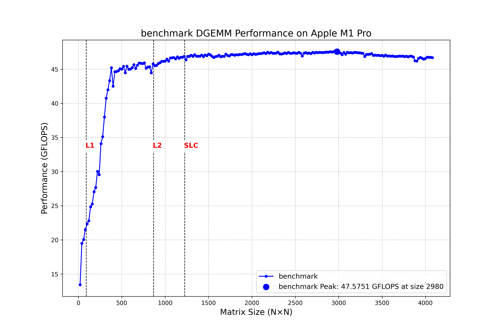

# Matrix Multiplication Acceleration on Apple M1 Pro

Apple M1 Pro의 P-core에서 FP64 행렬 곱셈(DGEMM)을 직접 최적화한 실험이다.
단순한 3중 루프에서 출발해 NEON 마이크로커널, 패널 패킹, 캐시 블로킹을
적용했다. 최종 단일 코어 구현은 **47.5751 GFLOPS**를 기록했다.



## 결과 요약

실험 장비는 6 P-core와 2 E-core가 탑재된 Apple M1 Pro이며, 아래 결과는
double precision 정방 행렬을 5회씩 측정한 기록이다.

| 구현 | 최고 성능 | 단일 P-core 이론치 대비 |
| --- | ---: | ---: |
| 직관적인 `i-j-k` 3중 루프 | 3.0037 GFLOPS | 5.82% |
| OpenBLAS, 1 thread | 49.2012 GFLOPS | 95.35% |
| 이 저장소의 10x4 NEON 커널 | **47.5751 GFLOPS** | **91.20%** |

최종 구현은 같은 조건의 OpenBLAS 최고 성능 대비 **96.6950%**에 도달했다.
멀티코어 실험은 243.4346 GFLOPS로 6 P-core 이론치의 83.5236%를 기록했지만,
행렬 크기에 따라 성능이 크게 출렁여 완성된 구현이 아닌 실험 기록으로 남겼다.

## 최적화 구조

M1 Pro P-core는 128-bit NEON 레지스터 32개와 FP/SIMD 파이프라인 4개를
제공한다. FMA를 연산 두 번으로 계산하면 FP64 기준 이론 성능은 다음과 같다.

```text
16 FLOP/cycle x 3.228 GHz = 51.648 GFLOPS (single P-core)
6 cores x 16 FLOP/cycle x 3.036 GHz = 291.456 GFLOPS
```

최종 구현은 다음 계층으로 구성된다.

1. **10x4 NEON 마이크로커널**
   - C 타일 누산에 벡터 레지스터 20개
   - A의 10개 scalar broadcast에 레지스터 10개
   - B의 4개 원소에 레지스터 2개
   - 총 32개 레지스터를 사용해 40개의 C 원소를 갱신한다.
2. **패널 패킹**
   - A를 마이크로커널이 연속으로 읽는 형태로 패킹한다.
   - B도 4열 타일 단위로 패킹해 같은 패널을 여러 행 블록에서 재사용한다.
3. **캐시 블로킹**
   - `PC=640`, `NC=520`, `MC=768`
   - 마이크로커널의 A/B 작업 집합은 약 70 KiB로 L1 안에 둔다.
   - A 패널은 약 2.66 MB, B 패널은 약 3.93 MB로 구성한다.
4. **`j-k-i` 루프 순서**
   - B 패널을 `k` 루프에서 패킹하고 A 패널을 `i` 루프에서 패킹한다.
   - 실험상 `i-k-j`의 47.1018 GFLOPS보다 근소하게 높은 결과를 냈다.

정식 API는 임의 크기의 row-major 행렬을 받는다. 완전한 10x4 타일은 NEON
커널로 처리하고, 남는 행과 열만 scalar 경로로 처리한다.

## 디렉터리 구조

```text
.
├── include/m1_matmul/dgemm.hpp   # 공개 API
├── src/dgemm_neon.cpp            # 10x4 NEON 커널과 패널화 구현
├── benchmarks/benchmark.cpp      # 재실행 가능한 CSV 벤치마크
├── tests/test_dgemm.cpp           # 다양한 shape의 정확성 검증
├── results/
│   ├── csv/                       # 대표 원본 측정값
│   └── plots/                     # README와 보고서용 대표 그래프
└── legacy/
    ├── tests/                     # 커널 크기/루프 순서 탐색 코드
    ├── benchmark_csv/             # 나머지 실험 결과
    ├── benchmark_plot/            # 나머지 실험 그래프
    └── avx2/                      # 후속 x86 AVX2 실험
```

`legacy`는 실험 과정을 보존하기 위한 아카이브다. 현재 읽고 실행할 코드는
`include`, `src`, `benchmarks`, `tests`에 있다.

## 빌드와 실행

### 요구 사항

- Apple Silicon Mac (`arm64`, NEON)
- C++17을 지원하는 Apple Clang 또는 GCC
- GNU Make

```bash
# 벤치마크 바이너리 빌드
make

# 여러 정방/비정방/경계 크기로 정확성 검증
make test

# 기본 범위: N=128..2048, step=128, 5 trials
make benchmark
```

원 보고서의 수치는 Homebrew GCC 15 계열로 측정했다. 같은 컴파일러를
사용하려면 다음처럼 `CXX`를 지정한다.

```bash
make clean
make CXX=g++-15
make CXX=g++-15 test
```

전체 보고서와 같은 범위로 실행하려면 다음처럼 지정한다.

```bash
./build/benchmark \
  --min 20 \
  --max 4080 \
  --step 20 \
  --trials 5 \
  --output results/benchmark-latest.csv
```

출력 CSV에는 `size`, `trial`, `seconds`, `gflops`가 기록된다. macOS의 전원
상태, 온도, 백그라운드 작업, 코어 배치에 따라 결과는 달라질 수 있다.

## API 예시

```cpp
#include "m1_matmul/dgemm.hpp"

// A: rows x inner, B: inner x cols, C: rows x cols (row-major)
m1_matmul::dgemm_neon(A, B, C, rows, inner, cols);
```

`dgemm_neon`과 `dgemm_naive`는 모두 기존 C 값을 덮어쓰고 `C = A x B`를
계산한다.

## 대표 결과 파일

- [단일 코어 NEON 10x4](results/csv/single-core-neon-10x4.csv)
- [단일 코어 OpenBLAS](results/csv/single-core-openblas.csv)
- [직관적인 3중 루프](results/csv/single-core-naive.csv)
- [상세 실험 기록](https://era-s.github.io/mlsys/matrix-multiplication-acceleration-m1-pro/)

## 참고 자료

- [DGEMM Tutorial](https://github.com/nakatamaho/dgemm_tutorial/blob/main/01_introduction.md)
- [The JAX Scaling Book - All About Rooflines](https://jax-ml.github.io/scaling-book/roofline/)
- [Dougall Johnson - Apple Firestorm](https://dougallj.github.io/applecpu/firestorm.html)
- [OpenBLAS](https://github.com/OpenMathLib/OpenBLAS)

## 한계와 다음 단계

- 블로킹 파라미터는 16 GB, 6 P-core 구성의 M1 Pro에 맞춰 수동 튜닝했다.
- 정식 구현은 단일 스레드다. OpenMP 시도는 재현 가능한 탐색 자료로만
  `legacy/tests/neon_4x8_openmp_test.cpp`에 보존했다.
- 성능 카운터 기반 프로파일링 없이 GFLOPS 곡선을 중심으로 튜닝했다.
- 후속 x86 AVX2 실험은 `legacy/avx2`에 있으며 M1용 정식 빌드에는 포함되지
  않는다.
